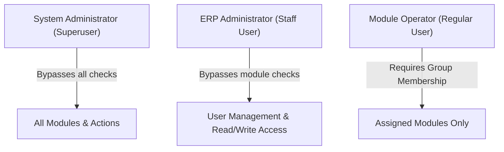

# Access Control & Role-Based Security (RBAC) Runbook

This guide describes the Role-Based Access Control (RBAC) architecture of the Intrex ERP/CRM platform and provides step-by-step instructions for system administrators to manage accounts, group permissions, and active sessions.

---

## 1. Security & Access Hierarchy

The platform relies on Django's built-in User-Group authorization system coupled with custom module decorators to control routing security. The access model is divided into three tiers:

### A. System Administrator (Superuser)
*   **Permissions:** Full read, write, and execute permissions across all modules.
*   **Unique Capabilities:**
    *   Promote users to Staff or Superuser status.
    *   Deactivate other superusers.
    *   Revoke active operator sessions through the Audit Log dashboard.

### B. ERP Administrator (Staff User)
*   **Permissions:** Has administrative privileges for account management.
*   **Capabilities:**
    *   Create, modify, and activate/deactivate regular user accounts.
    *   Assign module-level group memberships.
    *   Cannot change own active status or toggle other superusers.

### C. Module Operators (Regular Users)
*   **Permissions:** Restricted exclusively to the modules assigned to their user profile.
*   **Security Enforcement:** If they attempt to access an unauthorized route, the application renders a `403 Forbidden` response.

---

## 2. Module Group Mapping

Regular users gain access to individual modules by being added to corresponding Django Groups. The system maps these groups as follows:

| Group Name | Accessible Module | Technical URL Namespace | Decorator Scope |
| :--- | :--- | :--- | :--- |
| `hrm_access` | HR Management | `hrm` | `@module_access('hrm')` |
| `inventory_access` | Procurement & Stock | `inventory` | `@module_access('inventory')` |
| `investment_access` | Investment | `investment` | `@module_access('investment')` |
| `billing_access` | Accounts & Billing | `billing` | `@module_access('billing')` |
| `solutions_access` | Solutions & Projects | `solutions` | `@module_access('solutions')` |
| `training_access` | Training Module | `training` | `@module_access('training')` |
| `audit_logs_access` | System Audit Logs | `accounts:audit_logs` | `@module_access('audit_logs')` |

---

## 3. Core Access Control Decorators

Developers restrict views using three decorators defined in `accounts/decorators.py`:

### `@module_access(module_name)`
Performs a multi-layered check:
1. If the operator is not authenticated, redirects them to the `/login/` path.
2. If the operator is a superuser or staff member, allows immediate access.
3. Automatically retrieves or creates the Django Group named `{module_name}_access`.
4. If the user belongs to that group, permits execution.
5. Otherwise, redirects to the `403 Forbidden` page.

### `@staff_required`
Restricts access to system configurations and user management views. Only users with `is_staff` or `is_superuser` flags set to `True` are permitted.

### `@superuser_required`
Restricts high-risk commands (such as session revocation or data purge commands) to superusers only.

---

## 4. Administrative Workflows

### A. Creating a New User Account
1. Log in as an Administrator (Staff or Superuser).
2. Click **User Management** in the sidebar.
3. Click the **Create User** button in the upper right.
4. Input the following fields:
    *   **Username**: Must be unique across the platform.
    *   **Password**: Must meet complexity guidelines.
    *   **Email, First Name, Last Name**: Standard identity info.
5. Set User Attributes:
    *   Check **Is Staff (ERP Admin)** if the user requires permission to manage other users.
6. Select Modules:
    *   Check the boxes next to the modules the operator is authorized to access.
7. Click **Save**. The system creates the user and binds them to the correct `_access` groups.

### B. Modifying User Access Permissions
1. Navigate to **User Management**.
2. Click the **Edit** (pencil icon) next to the target user.
3. To alter permissions, check or uncheck the respective module boxes in the **Access Modules** list.
4. To reset password, input a new password in the password field (leave blank to keep current password).
5. Click **Save**. Group memberships are synchronized instantly.

### C. Deactivating an Operator Account
1. Navigate to **User Management**.
2. Find the target user in the directory list.
3. Locate the **Active/Deactivate** toggle button.
4. Confirm deactivation. The user will be locked out immediately upon their next request.
> [!WARNING]
> You cannot deactivate your own active session. Only superusers can deactivate other superusers.

### D. Revoking Active Sessions (Force Logout)
If an account is compromised or an operator needs to be logged out immediately:
1. Navigate to **Audit Logs** via the sidebar (requires `audit_logs` access or Superuser status).
2. Locate the **Active Sessions** card on the page.
3. Identify the session by username, IP address, and last-activity timestamp.
4. Click the **Terminate Session** button next to the target record.
5. The system destroys the session in the Django database store and deletes the registry trace, forcing an instant logout for that device.