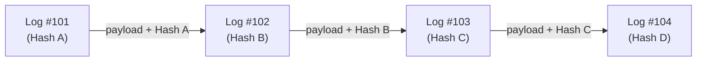

# Audit & Compliance Runbook

This runbook outlines the cryptographic audit logging system of the Intrex ERP/CRM platform. It describes how the application ensures data integrity, prevents database tampering, and exposes anomalies for administrative review.

---

## 1. System Audit Logs Overview

To maintain compliance and verify that no developer, administrator, or attacker has directly tampered with database log entries, the system records all security and data mutations into an immutable audit table.

The system tracks:
*   **Authentication Events**: Successful logins, logouts, and failed login attempts.
*   **Security Configuration Updates**: User creations, group associations, permissions adjustments, and active session terminations.
*   **High-Risk Data Operations**: Bulk exports, invoice voiding, and general ledger edits.

---

## 2. Cryptographic Hash Chain Architecture

The platform secures the log chain using a blockchain-like cryptographic hash linkage. Each audit log entry is linked to its chronological predecessor, ensuring that deleting or altering a past row will invalidate the hashes of all subsequent rows.



### Hash Calculation Method
For every new log entry, the system retrieves the previous database log's SHA-256 hash. If it is the first entry, it uses a default genesis hash of 64 zeros. 

The hash is calculated as:
$$\text{payload} = \text{user\_id} \mid \text{action} \mid \text{module} \mid \text{description} \mid \text{ip\_address} \mid \text{prev\_hash}$$
$$\text{sha256\_hash} = \text{SHA256}(\text{payload})$$

If an attacker manually deletes or modifies a database row in SQLite, the validation loop on the Audit Logs page will detect the broken link and immediately flag the system state as **COMPROMISED**.

---

## 3. Database-Level Immutability Controls

The application enforces immutability at the Django Model level to prevent accidental or malicious modifications:

### A. Update Prevention
The `save()` method in the `AuditLog` model is overridden to check if the primary key (`pk`) already exists:
```python
if self.pk is not None:
    raise PermissionDenied("Audit logs are immutable and cannot be updated.")
```

### B. Delete Prevention
A Django `pre_delete` signal listener intercepts all deletion requests:
```python
@receiver(pre_delete, sender=AuditLog)
def block_audit_log_delete(sender, instance, **kwargs):
    raise PermissionDenied("Audit logs are immutable and cannot be deleted.")
```
> [!CAUTION]
> These code-level protections prevent operations through the Django ORM (including the Admin Panel). They do not prevent raw SQL manipulation directly on the SQLite database, which is why the **Cryptographic Hash Chain** is used to verify integrity.

---

## 4. Performance: Asynchronous Logging

To prevent audit logging from slowing down user requests, the platform writes logs asynchronously:
*   **`log_action_async`**: Spawns a background daemon thread (`threading.Thread`) to execute the database write. The main thread immediately continues, ensuring zero performance overhead for the user.
*   **Test Environment Bypass**: During automated test suite runs (where `test` is in the arguments), writes are executed synchronously to prevent database locking conflicts in SQLite.

---

## 5. Administrative Verification Runbook

### A. Verifying Cryptographic Integrity
1. Log in as a user with `audit_logs` permission or as a **Superuser**.
2. Click **Audit Logs** in the sidebar.
3. Observe the **System Integrity Status** badge:
    *   <span style="color:#15803d; font-weight:700;">🟢 SECURE</span>: The hash chain is unbroken and matches all historical logs.
    *   <span style="color:#b91c1c; font-weight:700;">🔴 COMPROMISED</span>: A mismatch was found. The page will list the specific database record IDs that failed validation.
4. **Action on Compromise**: If the system status changes to `COMPROMISED`, retrieve the backup database, check database file write timestamps, and trace server access logs.

### B. Security Anomaly Monitoring
The Audit Logs dashboard alerts administrators to two key real-time indicators:
1. **Failed Login Spikes**: The dashboard tracks the count of `LOGIN_FAILED` actions within the last 24 hours. A spike may indicate a brute-force attack.
2. **Mass Exports Flag**: The dashboard highlights any actions containing `EXPORT` within the last 24 hours. Verify that these data exports were authorized.