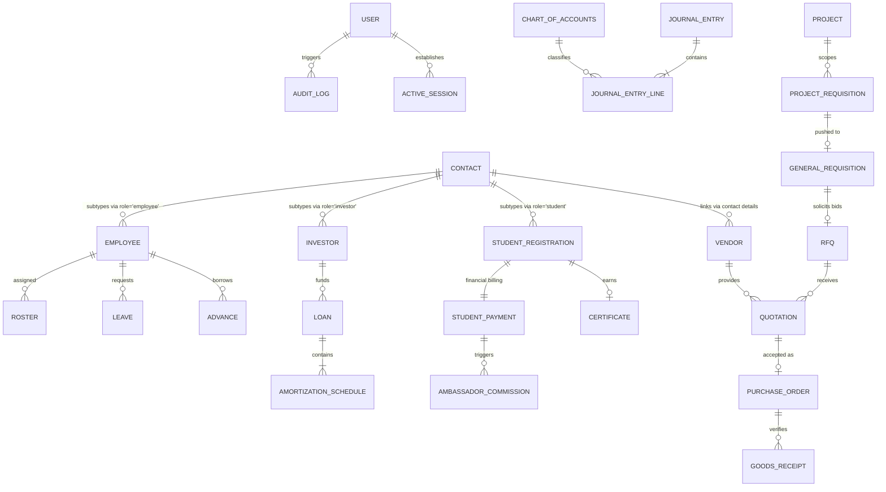

# Core Entity-Relationship (ER) Map & Database Schema

This document details the database skeletons for both the SQLite (User Access and System Security Logs) and Google Firestore NoSQL (Core ERP Business Logic) databases.

---

## Phase 3: Core Entity-Relationship (ER) Diagram

The diagram below highlights the Shared Master Entities (`User`, `Contact`, `Chart of Accounts`, `Journal Entry`) and how module-specific operational entities branch from them.

---

## Schema Structures & Collection Glossaries

### 1. Foundational Master Entities

#### `contacts` (Firestore Collection)
Acts as the global registry of physical persons and institutions. Tracks email/phone overlap across modules.
* **Fields:**
  * `id` (String - Document ID)
  * `legal_name` (String)
  * `email` (String - Unique Index)
  * `phone` (String)
  * `roles` (Array of Strings: `['employee', 'student', 'investor', 'vendor', 'client']`)
  * `created_at` (Timestamp)

#### `auth_user` (SQLite Table - Django Auth)
Holds account credentials, administration flags, and default permissions.
* **Fields:**
  * `id` (Integer - Primary Key)
  * `username` (String)
  * `email` (String)
  * `password` (String - PBKDF2 Hashed)
  * `is_staff` / `is_superuser` (Boolean)

#### `chart_of_accounts` (Firestore Collection)
Declares General Ledger accounts and financial classifications.
* **Fields:**
  * `id` (String - Document ID)
  * `account_code` (String - e.g., `11100`, `11200`, `21100`, `41000`, `51000`)
  * `name` (String - e.g., Cash, Accounts Receivable, Accounts Payable, Sales Revenue, Salary Expense)
  * `account_type` (String - Asset, Liability, Equity, Revenue, Expense)
  * `currency` (String)
  * `is_active` (Boolean)

#### `journal_entries` (Firestore Collection)
Maintains double-entry compliance records. Auto-posted by operational modules or created manually in the General Journal.
* **Fields:**
  * `id` (String - Document ID: `JE-YYYY-XXXX` or `AUTO-XXXX`)
  * `entry_code` (String)
  * `posting_date` (String - `YYYY-MM-DD`)
  * `reference_document` (String - e.g., `Invoice INV-1002`, `Payroll period April 2026`)
  * `narration` (String)
  * `status` (String - Draft, Posted, Voided)
  * `created_by` / `approved_by` (String)
  * `created_at` (Timestamp)
  * `lines` (Array of Maps):
    * `account_id` (String - reference to `chart_of_accounts`)
    * `debit_amount` (Double)
    * `credit_amount` (Double)

---

### 2. Module-Specific Entities

#### EdTech & Training (`training` module)
* **`learn_registrations`:** Tracks student enrollment. Points to `contacts.id` via `contact_id`.
* **`learn_payments`:** Maps financial fee schedules, installment arrangements, and payments. Points to `learn_registrations.id` (Document ID match).
* **`learn_course_assessments`:** Logs exam scores and final course passing eligibility.
* **`learn_certificates`:** Holds issued hashes for online certificate verification.

#### HR & Payroll (`hrm` module)
* **`employees`:** Contains bank info, tax configuration, department designations, and basic salary structure. Points to `contacts.id` via `contact_id`.
* **`hrm_attendance`:** Stores clock-in/clock-out timestamps and status (`Present`, `Absent`, `Late`).
* **`hrm_leaves`:** Tracks requested and approved days off.
* **`hrm_payrolls`:** Records monthly calculations (Net salary disbursements, advances, deductions).

#### Procurement & Inventory (`inventory` module)
* **`requisitions`:** Lists requested parts, quantity, and urgency. Pushed from IT Projects or operational managers.
* **`vendors`:** Contains supplier profiles, payment terms, and ratings.
* **`rfqs` / `quotations`:** RFQ requests and vendor price quotes.
* **`purchase_orders`:** Active procurement contracts issued to suppliers.
* **`goods_receipts`:** Logs inventory intake, quality inspections, and warehouse storage locations.
* **`products`:** Current physical items stock directory.
* **`inventory_ledger`:** Audit record of inventory changes (PO_Receipt, Stock_Adjustment, Client_Handover).

#### IT Solutions (`solutions` module)
* **`projects` / `project_phases`:** Project milestones and operational timelines.
* **`project_requisitions`:** Scoped asset acquisition requests. Converts to inventory `requisitions` when approved.
* **`software_licenses`:** Tracks subscriptions, keys, and asset handovers.

#### Investments (`investment` module)
* **`investors`:** KYC registers and bank accounts. Points to `contacts.id` via `contact_id`.
* **`investment_transactions`:** Inbound Capital, Interest Payout, and Dividend disbursement logs.
* **`investor_loans`:** Loans issued by investors to scale operations.
* **`loan_amortization_schedules`:** Month-by-month principal and interest repayments.