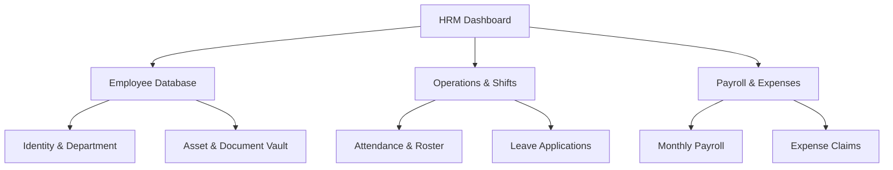

# HR Management (HRM) Guide

The HR Management (HRM) module allows HR administrators and department managers to track employee databases, approve leave applications, monitor daily shift rosters, and compile monthly payroll outputs.

---

## 1. Core Sub-Sections

The HRM module is split into several main workflows:

---

## 2. Managing the Employee Database

### A. Registering a New Employee
1. Navigate to **HRM** -> **Employee Database**.
2. Click the **Add Employee** button.
3. Fill in the profile fields:
    *   **Contact Association**: Connect the employee to a record in the contacts master directory.
    *   **Department**: Assign to a predefined department (e.g. IT Solutions, EdTech Academics).
    *   **Designation**: Enter the official job title (e.g. Senior Network Engineer).
    *   **Joining Date**: Record the official start date.
4. Click **Save**.

### B. Tracking Assets & Equipment
The **Document & Asset Vault** lists company-owned hardware (laptops, monitors, mobile phones) assigned to employees:
1. Navigate to **HRM** -> **Document & Asset Vault**.
2. Find the target employee and click **Assign Asset**.
3. Select the item, input serial numbers, and save. Upon employee exit, verify all items are checked back in.

---

## 3. Shift Attendance & Leave Approvals

### A. Roster & Daily Attendance
*   **Roster Management**: Allows managers to assign staff to specific morning, evening, or night shifts.
*   **Attendance logs**: Records user check-ins. If an operator fails to clock in within the shift grace period, they are flagged as *Late* or *Absent*.

### B. Processing Leave Applications
Employees submit leave requests through the platform. HR Managers review them under **HRM** -> **Leave Management**:
1. Open the **Leave Requests** view.
2. Select an application (Annual, Sick, or Casual leave).
3. Review the leave balance history.
4. Click **Approve** or **Reject** (inputting rejection comments). The system recalculates the employee's remaining leave balance.

---

## 4. Monthly Payroll Generation

To compile and calculate salaries:
1. Navigate to **HRM** -> **Payroll**.
2. Click **Generate Monthly Batch** and select the month.
3. The system pulls base salary settings and automatically calculates:
    *   **Allowances**: Standard bonuses or travel adjustments.
    *   **Deductions**: Tax percentages, late-arrival penalties, or unpaid leaves.
4. Click **Process Payroll**.
5. Once processed, click **Generate Pay Slip** to download or email the slip to the employee.