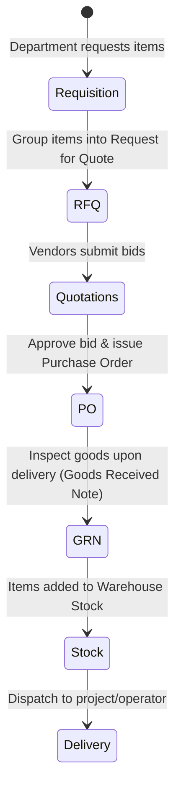

# Procurement & Inventory Guide

The Procurement & Inventory module manages the supply lifecycle of the enterprise, tracking vendors, purchase requisitions, RFQs, goods receipts, warehouse stock levels, and outward stock deliveries.

---

## 1. The Procurement Lifecycle

The platform models procurement through a multi-step sequence to ensure fiscal control:

---

## 2. Procurement Workflows

### Step A: Creating a Purchase Requisition
1. Navigate to **Inventory** -> **Requisitions**.
2. Click **Create Requisition**.
3. Input the required items, estimated unit cost, and purpose (e.g. IT Department laptops).
4. Save the request. It goes to the department manager for approval.

### Step B: Issuing an RFQ (Request for Quotations)
1. Go to **Inventory** -> **RFQ Management**.
2. Click **Create RFQ**.
3. Link the approved requisitions and select certified suppliers from the **Vendors Directory**.
4. Save and email the RFQ sheets. As vendors send back bids, input the prices in the RFQ panel to compile a quotation comparison sheet.

### Step C: Issuing a Purchase Order (PO)
1. In the comparative list, select the winning vendor quotation.
2. Click **Generate Purchase Order**.
3. Review payment terms and delivery targets, then click **Approve & Send PO**.

---

## 3. Stock Management & Receipts

### A. Goods Received Note (GRN)
When physical shipments arrive at the loading dock:
1. Navigate to **Inventory** -> **GRNs**.
2. Click **Create GRN** and link it to the matching **Purchase Order**.
3. Input the count of items received. Inspect for defects.
4. Click **Complete Receipt**.
> [!WARNING]
> Completing a GRN automatically updates item counts inside the stock ledger and flags the associated Purchase Order as *Delivered* or *Partially Delivered*.

### B. Warehouse Stock Checks
*   Navigate to **Inventory** -> **Stock Inventory**.
*   View active stock levels across different items.
*   **Low Stock Alerts**: Items falling below safety margins will highlight in red to prompt replenishment.

### C. Gatepass & Delivery Dispatches
When dispatching inventory to clients or internal projects:
1. Navigate to **Inventory** -> **Deliveries**.
2. Click **Create Delivery Note**.
3. Select items, quantities, and the target client contact.
4. Issue a gatepass copy for transport. This deducts the quantities from the warehouse stock ledger.