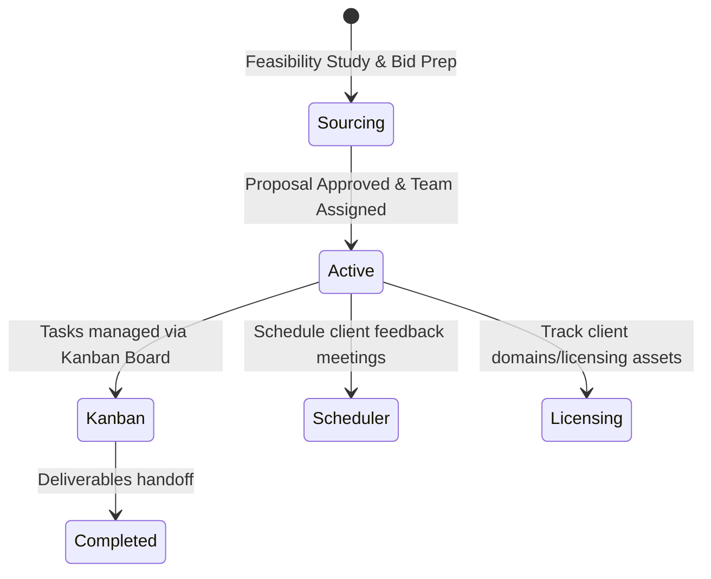

# Service Solutions & IT Projects Guide

The Service Solutions & IT Projects module supports client engagement pipelines, project feasibility checks, Kanban task boards, client software licensing trackers, and meeting schedules.

---

## 1. Project Management Lifecycle

The lifecycle of an IT project is managed from initial bid proposal to active support phases:

---

## 2. Project Sourcing & Scoping

Before a project is officially launched, sales teams and solution architects use the sourcing pipeline to check feasibility:
1. Navigate to **Solutions** -> **Project Sourcing**.
2. Click **Add Proposal**.
3. Fill in key metrics:
    *   **Project Title** and **Target Client**.
    *   **Scope Details** and **Estimated Cost Matrix**.
    *   **Feasibility Check**: Flags whether technical resources and bandwidth are available.
4. Review bids and print/send proposals. Once the client signs the contract, click **Approve & Initiate Project** to convert the lead into an active project.

---

## 3. Project Execution & Kanban Board

Active projects are tracked on the **Kanban Board** to organize daily development tasks:
1. Navigate to **Solutions** -> **Kanban Board**.
2. Select your project from the dropdown.
3. The board displays columns for:
    *   **Backlog**: Scoped items waiting to be scheduled.
    *   **To Do**: Tasks ready for developers.
    *   **In Progress**: Tasks actively being worked on.
    *   **Review**: Deliverables waiting for QA or client confirmation.
    *   **Done**: Completed deliverables.
4. Drag and drop cards to change task status, assign tasks to engineers, or set deadlines.

---

## 4. Meetings, Stakeholders & Licensing

### A. Client Stakeholders & Scheduler
*   **Client Stakeholders**: Manage names, roles (e.g. Project Owner, Tech Lead), and email contacts for client employees.
*   **Meeting Scheduler**: Set agendas, log meeting links, and store minutes of meetings directly within the project record for reference.

### B. Client Software Licensing & Assets
For SaaS solutions, hosting provisions, and software handoffs:
1. Navigate to **Solutions** -> **Licensing & Assets**.
2. Register client assets (e.g. domain names, SSL certificates, custom software license keys).
3. Set **Activation Date** and **Expiry Date**.
4. The dashboard will trigger alerts as license renewal dates approach to prevent service interruptions.